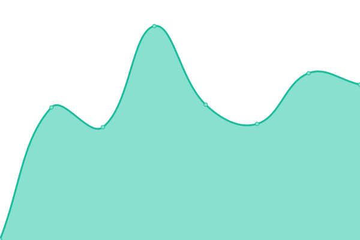
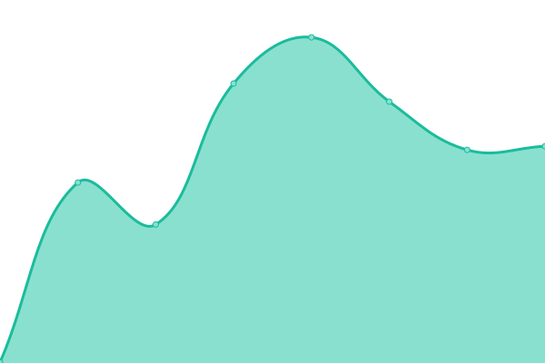
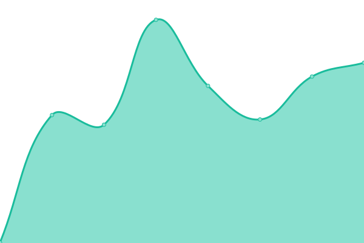
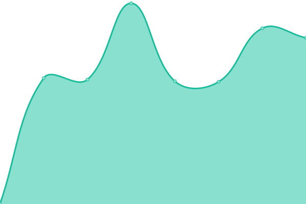
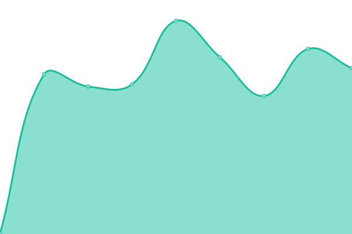

# [📈 Live Status](https://demo.upptime.js.org): <!--live status--> **🟩 All systems operational**

This repository contains the open-source uptime monitor and status page for [Ramón López](https://rlopez.super.site/), powered by [Upptime](https://github.com/upptime/upptime).

With [Upptime](https://upptime.js.org), you can get your own unlimited and free uptime monitor and status page, powered entirely by a GitHub repository. We use [Issues](https://github.com/ralona/upptime/issues) as incident reports, [Actions](https://github.com/ralona/upptime/actions) as uptime monitors, and [Pages](https://demo.upptime.js.org) for the status page.

<!--start: status pages-->
<!-- This summary is generated by Upptime (https://github.com/upptime/upptime) -->
<!-- Do not edit this manually, your changes will be overwritten -->
<!-- prettier-ignore -->
| URL | Status | History | Response Time | Uptime |
| --- | ------ | ------- | ------------- | ------ |
|  [Google](https://www.google.com) | 🟩 Up | [google.yml](https://github.com/ralona/upptime/commits/HEAD/history/google.yml) | 

 122ms
     
 | 

<a href="https://demo.upptime.js.org/history/google">100.00%</a>
    

|  [Finizens](https://app.finizens.com) | 🟩 Up | [finizens.yml](https://github.com/ralona/upptime/commits/HEAD/history/finizens.yml) | 

 552ms
     
 | 

<a href="https://demo.upptime.js.org/history/finizens">100.00%</a>
    

|  [Sesame HR (front)](https://app.sesametime.com) | 🟩 Up | [sesame-hr-front.yml](https://github.com/ralona/upptime/commits/HEAD/history/sesame-hr-front.yml) | 

 532ms
     
 | 

<a href="https://demo.upptime.js.org/history/sesame-hr-front">100.00%</a>
    

|  [Sesame HR (back)](https://back.sesametime.com/api/v3/pre-register/7e60c534-86f8-4d05-8d97-a25e9b2f4f5b) | 🟩 Up | [sesame-hr-back.yml](https://github.com/ralona/upptime/commits/HEAD/history/sesame-hr-back.yml) | 

 459ms
     
 | 

<a href="https://demo.upptime.js.org/history/sesame-hr-back">100.00%</a>
    

|  [Signaturit](https://app.signaturit.com) | 🟩 Up | [signaturit.yml](https://github.com/ralona/upptime/commits/HEAD/history/signaturit.yml) | 

 3481ms
     
 | 

<a href="https://demo.upptime.js.org/history/signaturit">99.53%</a>
    

|  [Pedidos RA](https://pedidosra.ivsign.com) | 🟩 Up | [pedidos-ra.yml](https://github.com/ralona/upptime/commits/HEAD/history/pedidos-ra.yml) | 

 1314ms
     
 | 

<a href="https://demo.upptime.js.org/history/pedidos-ra">100.00%</a>
    

<!--end: status pages-->

[**Visit our status website →**](https://demo.upptime.js.org)

## 📄 License

- Powered by: [Upptime](https://github.com/upptime/upptime)
- Code: [MIT](./LICENSE) © [Ramón López](https://rlopez.super.site/)
- Data in the `./history` directory: [Open Database License](https://opendatacommons.org/licenses/odbl/1-0/)
